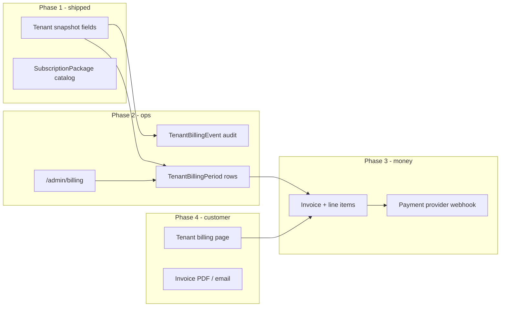

# Tenant billing — design spec

**Phase 1:** Shipped · **Migration:** `20260703120000_tenant_billing`  
**Last updated:** 2026-07-03  
**Related:** [`FEATURES.md`](../FEATURES.md) §7 · `SubscriptionPackage` · `Tenant.currentPackageId`

---

## Purpose

Define when a tenant (organization or individual) **starts the billing clock** (`billing_start_date`), how subscription packages attach, and the **scale path** to full billing ops (history, invoices, admin) without rewrites.

Phase 1 fields on `Tenant` are intentional **snapshots for the current period**. They are not the long-term ledger — see [Scale roadmap](#scale-roadmap-best-case-many-tenants).

---

## Product context (shipped)

| Piece | Today |
|-------|--------|
| `SubscriptionPackage` | Price, discount, `billingInterval`, `maxProjects`, `maxUsers`, `features[]` |
| `Tenant.currentPackageId` | Package assigned at org creation or by SUPER_ADMIN |
| `Tenant.entityType` | `ORGANIZATION` \| `INDIVIDUAL` |
| `Tenant.billing*` fields | Status, `billingStartDate`, current period, `activatedBy` |
| Feature gating | Package checkboxes → web + API (`packageAccessService`) |
| `maxProjects` | Enforced on `POST /projects` |
| `maxUsers` | Enforced on member create + invite accept |
| `tenantBillingService` | Activate on login; `computePeriodEnd` |
| Admin UI | `/admin/organizations` — billing status + start date columns |
| Payment gateway | **None** — manual invoicing for now |

Typical flows:

1. SUPER_ADMIN creates org, assigns package, sends invites (`/admin/organizations`).
2. Self-service `/setup` (TenantSetupPage) — user picks ORG/INDIVIDUAL + category + package.
3. Member accepts invite → sets password → logs in → **billing activates on first login**.

---

## Decisions (locked)

These choices are **fixed**. Alternatives listed under [Rejected options](#rejected-options) must not be implemented.

| # | Decision | Choice |
|---|----------|--------|
| 1 | **When does billing start?** | On the **first successful login** by any active member of the tenant. |
| 2 | **Who is “first user”?** | The first member (any role) whose login succeeds while `billingStartDate` is still null. Not limited to `TENANT_ADMIN`. |
| 3 | **Pre-activation access** | **Full package** (features + quotas per `currentPackageId`). No reduced trial mode before activate. |
| 4 | **Trial period after activate** | **None in phase 1.** `billing_start_date` = start of the paid period for admin/reporting; no free X-day trial. |
| 5 | **Timezone** | `Asia/Bangkok` for period boundaries (aligned with existing schedulers). |
| 6 | **Platform staff** | `SUPER_ADMIN` / `MODERATOR` logins do **not** activate tenants unless they hold a real `TenantMembership`. |

### Activate trigger (normative)

```
POST /auth/login → credentials valid → user.isActive
  → for each tenant where user has isActive membership:
       if tenant.billingStartDate IS NULL:
         set billingStartDate, activatedAt, activatedByUserId
         set billingStatus = ACTIVE
         set currentPeriodStart / currentPeriodEnd from package.billingInterval
         (single transaction; idempotent WHERE billingStartDate IS NULL)
```

Same hook may run after flows that end in an authenticated session (e.g. invite accept if it returns tokens and the client logs in). **Do not** use a separate activate endpoint for normal cases.

**Rejected:** activate only after `POST /auth/change-password`, activate only for `TENANT_ADMIN`, activate at tenant `createdAt`, activate on invite send.

---

## Rejected options

| Option | Why not |
|--------|---------|
| Activate on password change only | Product owner chose **login success** as the single trigger. |
| Activate on tenant create | Billing would start before the customer uses the product; unfair for admin-provisioned orgs. |
| Activate on invite accept (without login) | Accept may not equal usage; login is the agreed signal. |
| Limited features before activate | Full package before activate is required. |
| Free trial N days after activate | Out of scope phase 1; billing period starts on first login. |
| Separate `TenantSubscription` table now | Phase 1 uses `Tenant` snapshot; **phase 2 adds ledger tables** — see [Scale roadmap](#scale-roadmap-best-case-many-tenants) |
| Auto payment / Stripe / Omise | Phase 2+; see [Out of scope](#out-of-scope-phase-1). |

---

## Data model (phase 1 — shipped)

On **`Tenant`**:

| Field | Type | Notes |
|-------|------|--------|
| `billingStatus` | enum | See [Billing status](#billing-status) |
| `billingStartDate` | `DateTime?` | **Set once** on first login |
| `billingTimezone` | `String` | Default `Asia/Bangkok` |
| `currentPeriodStart` | `DateTime?` | Current open period |
| `currentPeriodEnd` | `DateTime?` | End of current period |
| `activatedAt` | `DateTime?` | Activation timestamp |
| `activatedByUserId` | `String?` | FK → `User` |

```prisma
enum TenantBillingStatus {
  PENDING_ACTIVATION
  ACTIVE
  PAST_DUE
  SUSPENDED
  CANCELLED
}
```

New tenants: `PENDING_ACTIVATION`, `billingStartDate = null`.  
**Keep these fields in phase 2** as a fast read cache; ledger tables become source of truth for history.

---

## Scale roadmap (best case: many tenants)

Design principle: **never lose billing history**, **never recompute money from logs**, **admin can operate at 1k+ orgs without opening each org row**.



### Phase 2 — Billing ops (build before “เยอะมาก”)

**When:** ~50+ paying orgs, or finance needs monthly close, or >1 person doing billing admin.

| Deliverable | Why |
|-------------|-----|
| **`TenantBillingEvent`** | Append-only audit: `ACTIVATED`, `PERIOD_OPENED`, `PERIOD_CLOSED`, `PACKAGE_CHANGED`, `MARKED_PAST_DUE`, `MARKED_PAID`, `SUSPENDED`. Who/when/what JSON. |
| **`TenantBillingPeriod`** | One row per billing cycle per tenant: `periodStart`, `periodEnd`, `packageId` snapshot, `amountCents`, `status` (`OPEN` \| `INVOICED` \| `PAID` \| `VOID`). **History lives here**, not on `Tenant`. |
| **`POST` activate / cron** | On activate → write `ACTIVATED` event + first `OPEN` period. Nightly cron rolls `currentPeriodEnd` → close period + open next (leader lock if multi-replica API). |
| **`GET /admin/billing/periods`** | Paginated list: org, package, period, status, MRR, due date. Filters: `PAST_DUE`, ending this week. |
| **`GET /admin/tenants/:id/billing`** | Timeline: events + periods for one org. |
| **Web: `/admin/billing`** | SUPER_ADMIN menu **Billing** (not buried in org table only). Org page links “View billing history”. |
| **Export CSV** | Periods due this month — finance workflow before payment gateway. |

**Prisma sketch (phase 2):**

```prisma
model TenantBillingEvent {
  id          String   @id @default(cuid())
  tenantId    String
  actorUserId String?
  type        String   // ACTIVATED, PERIOD_OPENED, ...
  payloadJson Json?
  createdAt   DateTime @default(now())
  tenant      Tenant   @relation(...)
  @@index([tenantId, createdAt])
  @@index([type, createdAt])
}

model TenantBillingPeriod {
  id              String   @id @default(cuid())
  tenantId        String
  periodStart     DateTime
  periodEnd       DateTime
  packageId       String
  packageCode     String   // snapshot
  amountCents     Int
  currency        String   @default("THB")
  status          String   // OPEN, INVOICED, PAID, VOID
  closedAt        DateTime?
  createdAt       DateTime @default(now())
  tenant          Tenant   @relation(...)
  @@index([tenantId, periodStart])
  @@index([status, periodEnd])
}
```

**Migration from phase 1:** For each `ACTIVE` tenant, insert one `OPEN` period from `currentPeriodStart`/`End` + `ACTIVATED` event. No change to activate-on-login rule.

### Phase 3 — Invoices & payments

| Deliverable | Why |
|-------------|-----|
| **`Invoice` + `InvoiceLineItem`** | Legal record; package + seat overage + discount lines frozen at issue time. |
| **Omise / Stripe / PromptPay** | Webhook → `Payment` row → period `PAID`. Idempotent by provider event id. |
| **Auto `PAST_DUE`** | Cron: period end + grace → `billingStatus` + optional soft block policy. |
| **Proration rules** | Documented; implement only when upgrades are frequent. |

### Phase 4 — Tenant-facing

| Deliverable | Who |
|-------------|-----|
| **`/settings/billing`** or profile tab | `TENANT_ADMIN` — current plan, next renewal, download invoices |
| **Email** | Renewal reminder, payment receipt |
| **Seat usage** | `activeMembers / maxUsers`, upgrade CTA |

### Admin navigation (target)

| Route | Role | Phase |
|-------|------|-------|
| `/admin/organizations` | SUPER_ADMIN, MODERATOR | 1 ✓ summary columns |
| `/admin/billing` | SUPER_ADMIN | 2 — **add menu** |
| `/admin/billing/periods/:id` | SUPER_ADMIN | 2 |
| `/admin/packages` | SUPER_ADMIN | existing |

Sidebar `navigation.ts` — add under admin block:

```typescript
{ id: 'admin-billing', to: '/admin/billing', labelKey: 'navigation.adminBilling', systemRoles: ['SUPER_ADMIN'] }
```

### Ops at scale (always apply)

| Concern | Approach |
|---------|----------|
| **Cron singleton** | Same pattern as morning briefing — document leader lock before 2+ API replicas |
| **Indexes** | `(status, periodEnd)`, `(tenantId, createdAt)` on events |
| **No hot writes on login** | Activate stays one conditional `UPDATE`; period roll in cron |
| **Package price changes** | Period rows **snapshot** `packageCode` + `amountCents`; catalog edits don’t rewrite history |
| **Reporting** | MRR = sum of `OPEN`/`INVOICED` periods in month; don’t scan `Tenant` only |
| **Support** | Every admin action on billing → `TenantBillingEvent` |

### What we deliberately did *not* do in phase 1

- Full history table — would be empty noise until payments exist; snapshot on `Tenant` is enough for day one.
- Separate billing menu — org list columns suffice until ops volume justifies `/admin/billing`.

**Verdict for “คนใช้เยอะ”:** Plan phase 2 **before** first production payment provider, not after finance is drowning. Phase 1 rules (activate on login, no trial) **do not change**.

---

## Recommended build order

| Priority | Item | Effort |
|----------|------|--------|
| P0 | Phase 1 (done) | — |
| P1 | `TenantBillingEvent` + log on activate / package change | Small |
| P1 | `/admin/billing` read-only period list (from `Tenant` snapshot first) | Medium |
| P2 | `TenantBillingPeriod` + nightly period roll cron | Medium |
| P2 | Mark paid / past due admin actions + events | Small |
| P3 | Invoice table + CSV/PDF export | Medium |
| P4 | Payment webhook + tenant billing page | Large |

---

## Billing status

| Status | Meaning | App access (phase 1) |
|--------|---------|----------------------|
| `PENDING_ACTIVATION` | Package assigned; no successful member login yet | **Full** per package |
| `ACTIVE` | `billingStartDate` set | Full per package |
| `PAST_DUE` | Invoice overdue (manual flag) | Full until admin policy added |
| `SUSPENDED` | Billing/org suspended | Block with existing `isActive` patterns |
| `CANCELLED` | Closed account | Block |

Phase 1 does **not** auto-suspend on `currentPeriodEnd`; dates are for **admin visibility** and future cron.

---

## Billing cycle

Read `SubscriptionPackage.billingInterval`:

| Interval | `currentPeriodEnd` (from `billingStartDate`) |
|----------|-----------------------------------------------|
| `MONTHLY` | Same calendar day next month (clamp e.g. Jan 31 → Feb 28) |
| `YEARLY` | +1 year |
| `ONE_TIME` | `null` or far-future — product decision when implementing |
| `CUSTOM` | Admin-defined later |

Renewal cron and proration are **not** phase 1.

---

## Package changes vs billing dates

| Event | Behaviour |
|-------|-----------|
| SUPER_ADMIN changes `currentPackageId` | Apply features/quotas immediately |
| Package change after activate | **Do not** reset `billingStartDate` |
| Upgrade/downgrade mid-period | No proration in phase 1 |

---

## Code touchpoints (phase 1 — shipped)

| Location | Status |
|----------|--------|
| `prisma/schema.prisma` + `20260703120000_tenant_billing` | Done |
| `tenantBillingService.ts` | Done |
| `POST /auth/login` | Done |
| `POST /auth/invitations/:token/accept` | Done (activate + quota) |
| `GET /tenants/me` | Done — billing fields on tenant |
| `/admin/organizations` | Done — status + start date columns |

---

## Enforcement (phase 1)

| Rule | Status |
|------|--------|
| `maxUsers` | Enforced — member create + invite accept |
| `maxProjects` | Enforced — `POST /projects` |

---

## Backfill (existing tenants)

For tenants already in production before this feature:

1. Set `billingStatus = ACTIVE`.
2. Set `billingStartDate` to best estimate:
   - earliest successful login of any member (if auditable), else
   - `Tenant.createdAt`.
3. Compute `currentPeriodStart` / `currentPeriodEnd` from package interval.

Document backfill run in [`CHANGELOG.md`](../CHANGELOG.md) when executed.

---

## Example timeline

```
Day 1   SUPER_ADMIN creates "ACME Corp", package STANDARD
        billingStatus = PENDING_ACTIVATION, billingStartDate = null
        Team can be invited; full STANDARD features

Day 3   Invite ceo@acme.com (TENANT_ADMIN)

Day 5   CEO login success (first ever for this tenant)
        billingStartDate = 2026-07-05
        currentPeriodEnd   = 2026-08-05 (MONTHLY)
        billingStatus = ACTIVE, activatedByUserId = CEO

Day 20  Second member logs in
        → billingStartDate unchanged
```

**INDIVIDUAL tenant:** creator usually logs in right after `/setup` → billing starts that day.

---

## API surface (planned)

### Tenant admin — extend `GET /tenants/me` membership payload

```json
{
  "tenant": {
    "billingStatus": "ACTIVE",
    "billingStartDate": "2026-07-05T08:12:00.000Z",
    "currentPeriodStart": "2026-07-05T08:12:00.000Z",
    "currentPeriodEnd": "2026-08-05T08:12:00.000Z",
    "activatedAt": "2026-07-05T08:12:00.000Z"
  }
}
```

### SUPER_ADMIN — extend org detail on `/admin/tenants`

Same fields + `activatedBy` user email/name.

---

## Out of scope (later phases)

See [Scale roadmap](#scale-roadmap-best-case-many-tenants). Not in phase 1:

- Payment collection automation
- Invoice PDF / email
- Cron auto-renew (phase 2)
- Proration
- Usage-based billing (AI tokens, ASR minutes)
- Tenant self-service billing portal (phase 4)

Track progress in [`HANDOVER.md`](../HANDOVER.md).

---

## Verification (after implementation)

1. Create org as SUPER_ADMIN → `billingStartDate` null, status `PENDING_ACTIVATION`.
2. First member login → dates set, status `ACTIVE`; second login → idempotent.
3. INDIVIDUAL `/setup` → first login sets date.
4. Features work identically before and after activate (only dates change).
5. Admin org list shows billing columns.
6. Concurrent first logins → single `billingStartDate`.

---

## References

- Package catalog: [`FEATURES.md`](../FEATURES.md) §7  
- Schema: `apps/api/prisma/schema.prisma` — `Tenant`, `SubscriptionPackage`  
- Auth: `apps/api/src/routes/auth.ts` — `POST /login`  
- Package access: `apps/api/src/services/packageAccessService.ts`
